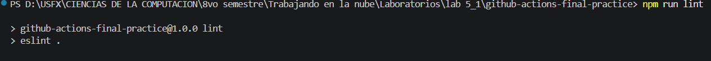
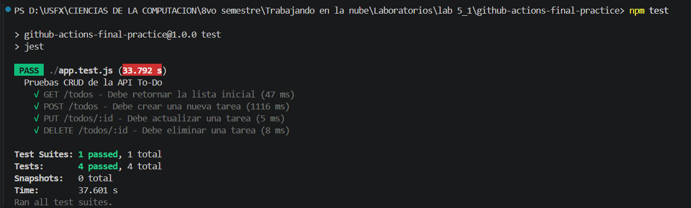
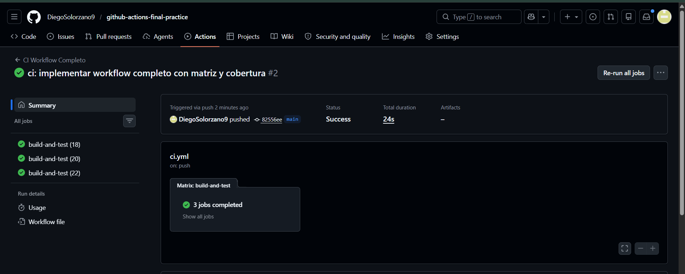
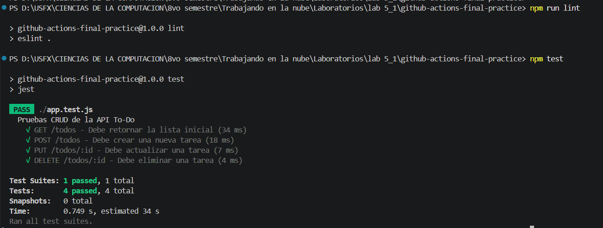
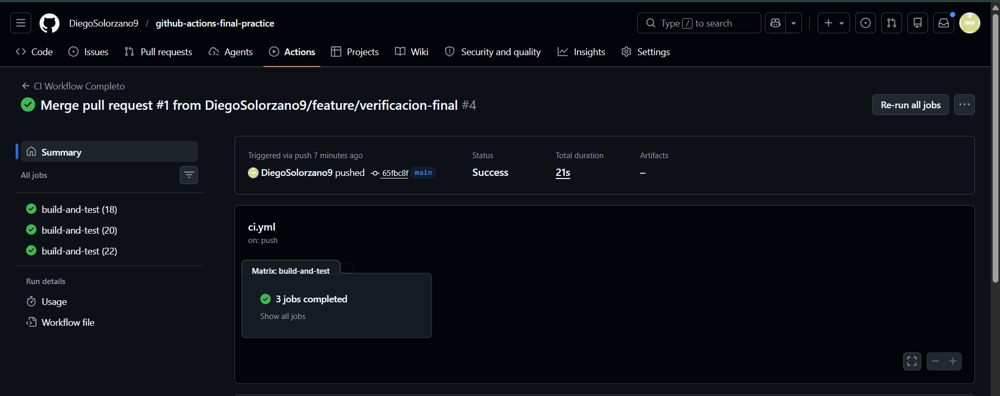
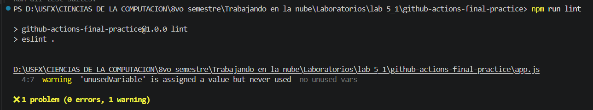
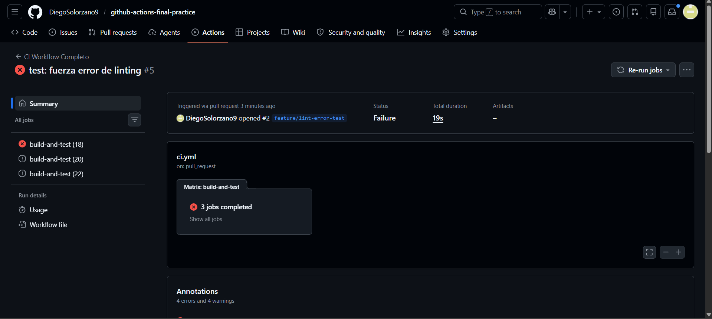
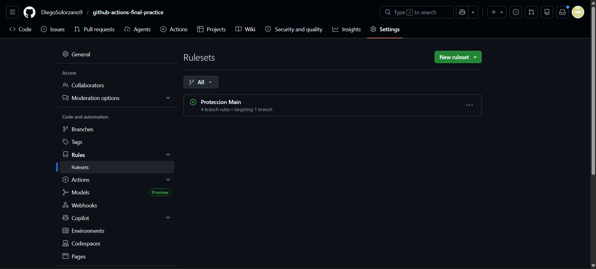
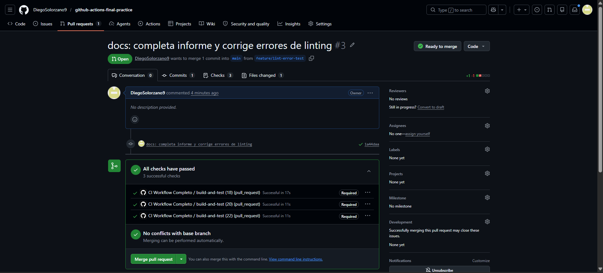

# INFORME - Práctica Individual: Integración Continua con GitHub Actions 🚀

## Datos Generales 📋

- **Asignatura:** Trabajando en la Nube
- **Laboratorio:** Práctica Individual - CI con GitHub Actions
- **Framework utilizado:** Express.js
- **Lenguaje:** JavaScript (Node.js)
- **Herramientas de testing:** Jest y Supertest
- **Herramientas de calidad de código:** ESLint
- **Repositorio GitHub:**  
  https://github.com/DiegoSolorzano9/github-actions-final-practice

---

# 1. Introducción 📖

En esta práctica individual se desarrolló una API REST utilizando Node.js y Express.js con una entidad de dominio llamada **Todos (Tareas)**.

El objetivo principal fue implementar un flujo completo de Integración Continua (CI) utilizando GitHub Actions, automatizando:

- Validación del código fuente
- Linting
- Ejecución de pruebas unitarias
- Generación de cobertura
- Validación automática mediante Pull Requests
- Protección de la rama principal (`main`)

---

# 2. Descripción del Proyecto 🧩

La aplicación desarrollada corresponde a una API CRUD de tareas (`Todos`) que permite:

- Crear tareas
- Obtener tareas
- Actualizar tareas
- Eliminar tareas

La aplicación fue construida utilizando el framework **Express.js**, ejecutándose sobre Node.js.

---

# 3. Estructura del Proyecto 📁

```text
github-actions-final-practice/
│
├── .github/
│   └── workflows/
│       └── ci.yml
│
├── app.js
├── server.js
├── app.test.js
├── eslint.config.mjs
├── package.json
├── package-lock.json
├── README.md
```

---

# 4. Implementación de la API CRUD ⚙️

## Archivo `app.js`

```javascript
const express = require('express');
const app = express();
app.use(express.json());

// Entidad de dominio: Tareas (Todos)
let todos = [
  { id: 1, task: 'Configurar GitHub Actions', completed: true }
];

// READ: Obtener todos
app.get('/todos', (req, res) => {
  res.status(200).json(todos);
});

// CREATE: Agregar uno
app.post('/todos', (req, res) => {
  const newTodo = {
    id: todos.length + 1,
    task: req.body.task,
    completed: req.body.completed || false
  };
  todos.push(newTodo);
  res.status(201).json(newTodo);
});

// UPDATE: Marcar como completado
app.put('/todos/:id', (req, res) => {
  const id = parseInt(req.params.id);
  const todo = todos.find(t => t.id === id);
  if (todo) {
    todo.completed = req.body.completed !== undefined ? req.body.completed : todo.completed;
    res.status(200).json(todo);
  } else {
    res.status(404).json({ message: "Tarea no encontrada" });
  }
});

// DELETE: Eliminar
app.delete('/todos/:id', (req, res) => {
  const id = parseInt(req.params.id);
  todos = todos.filter(t => t.id !== id);
  res.status(204).send();
});

module.exports = app;
```

---

# 5. Implementación de Pruebas Unitarias 🧪

## Archivo `app.test.js`

```javascript
const request = require('supertest');
const app = require('./app');

describe('Pruebas CRUD de la API To-Do', () => {
  
  test('GET /todos - Debe retornar la lista inicial', async () => {
    const res = await request(app).get('/todos');
    expect(res.statusCode).toBe(200);
    expect(res.body.length).toBeGreaterThan(0);
  });

  test('POST /todos - Debe crear una nueva tarea', async () => {
    const res = await request(app)
      .post('/todos')
      .send({ task: 'Probar el pipeline', completed: false });
    expect(res.statusCode).toBe(201);
    expect(res.body.task).toBe('Probar el pipeline');
  });

  test('PUT /todos/:id - Debe actualizar una tarea', async () => {
    const res = await request(app)
      .put('/todos/1')
      .send({ completed: false });
    expect(res.statusCode).toBe(200);
    expect(res.body.completed).toBe(false);
  });

  test('DELETE /todos/:id - Debe eliminar una tarea', async () => {
    const res = await request(app).delete('/todos/1');
    expect(res.statusCode).toBe(204);
  });

});
```

---

# 6. Verificación Local del Proyecto ✅

Antes de configurar GitHub Actions, se realizaron pruebas locales.

## Instalación de Dependencias

```bash
npm install
```

---

## Ejecución del Linter

```bash
npm run lint
```

### Resultado esperado

```text
Sin errores de linting
```

## Evidencia



---

## Ejecución de Pruebas Unitarias

```bash
npm test
```

### Resultado esperado

```text
PASS ./app.test.js

Test Suites: 1 passed, 1 total
Tests:       4 passed, 4 total
```

## Evidencia



---

# 7. Configuración del Workflow de CI ⚡

Se configuró un workflow completo de Integración Continua utilizando GitHub Actions.

## Archivo `.github/workflows/ci.yml`

```yaml
name: CI Workflow Completo

on:
  push:
    branches: [ main ]
  pull_request:
    branches: [ main ]

jobs:
  build-and-test:
    runs-on: ubuntu-latest

    # Uso de Matriz para probar en varias versiones (Requisito 3.4)
    strategy:
      matrix:
        node-version: [18, 20, 22]

    steps:
      # 1. Checkout del código
      - name: Checkout del codigo
        uses: actions/checkout@v4

      # 2. Setup del entorno de ejecución
      - name: Configurar Node.js ${{ matrix.node-version }}
        uses: actions/setup-node@v4
        with:
          node-version: ${{ matrix.node-version }}
          cache: 'npm' # Optimiza la instalación

      # 3. Instalación de dependencias
      - name: Instalar dependencias
        run: npm ci --legacy-peer-deps

      # 4. Linting (Análisis estático)
      - name: Ejecutar Linting
        run: npm run lint

      # 5. Ejecución de pruebas y Generación de reporte de cobertura
      - name: Ejecutar pruebas con cobertura
        run: npx jest --coverage
```

---

# 8. Funcionalidades Implementadas en el Pipeline 🔄

El workflow automatiza las siguientes tareas:

- Checkout automático del código
- Configuración de Node.js
- Instalación automática de dependencias
- Ejecución de ESLint
- Ejecución de pruebas unitarias
- Generación de cobertura
- Ejecución paralela con Node.js 18 y 20

---

# 9. Ejecución Automática del Workflow 🚀

Cada vez que se realiza:

- Un `push`
- Un `pull_request`

GitHub Actions ejecuta automáticamente el pipeline configurado.

## Evidencia



---

# 10. Workflow Exitoso ✅

El workflow ejecutó correctamente todas las etapas:

- Linting
- Tests
- Cobertura

## Evidencia




---

# 11. Simulación de Workflow Fallido ❌

Para verificar el funcionamiento del pipeline, se introdujo intencionalmente un error de linting.

## Error introducido

```javascript
const unusedVariable = 'error intencional';
```

---

## Resultado observado

El workflow falló automáticamente en la etapa de linting.

## Evidencia




---

# 12. Configuración de Protección de Rama 🔒

Se configuró una regla de protección para la rama `main`.

## Configuración aplicada

Ruta utilizada:

```text
Settings > Branches > Add rule
```

Opciones habilitadas:

- Require status checks to pass before merging
- Require pull request reviews before merging
- Workflow obligatorio: `CI Pipeline`

## Evidencia



---

# 13. Creación y Validación de Pull Request 🔀

Se creó una rama feature para validar el comportamiento del pipeline mediante Pull Request.

## Comandos utilizados

```bash
git checkout -b feature/lint-error-test
```

---

```bash
git add .
git commit -m "docs: actualiza documentacion del proyecto"
git push origin feature/lint-error-test
```

---

## Resultado observado

- GitHub ejecutó automáticamente el workflow.
- El merge quedó bloqueado hasta aprobar el pipeline.
- Una vez exitoso, el merge fue permitido.

## Evidencia



---

# 14. Integración del Informe en README.md 📄

Se agregó una sección de documentación dentro del archivo `README.md`.

## Contenido agregado

```markdown
## Documentación del Laboratorio

Puedes encontrar el informe completo con capturas de pantalla y evidencias en el siguiente enlace:

- [Ver informe del laboratorio](./INFORME.md)
```

---

# 15. Resultados Obtenidos 📊

Con esta práctica se logró implementar exitosamente:

- API CRUD completa ✅
- Framework moderno con Express.js ✅
- Tests unitarios e integración ✅
- Pipeline completo de CI con GitHub Actions ✅
- Cobertura automática de pruebas ✅
- Linting automatizado ✅
- Protección de rama principal ✅
- Validación automática mediante Pull Requests ✅

---

# 16. Conclusiones 📚

La Integración Continua permite detectar errores tempranamente y automatizar tareas repetitivas dentro del flujo de desarrollo.

El uso de GitHub Actions facilitó la validación automática del proyecto ante cada cambio realizado en el repositorio.

Las pruebas unitarias, el linting y la protección de ramas ayudan a mantener la estabilidad y calidad del código antes de integrarlo a producción.

Además, la ejecución automática de workflows mediante Pull Requests mejora significativamente el trabajo colaborativo y evita la integración de código defectuoso en la rama principal.

---

# 17. Enlace del Repositorio 🌐

Repositorio oficial del proyecto:

https://github.com/DiegoSolorzano9/github-actions-final-practice